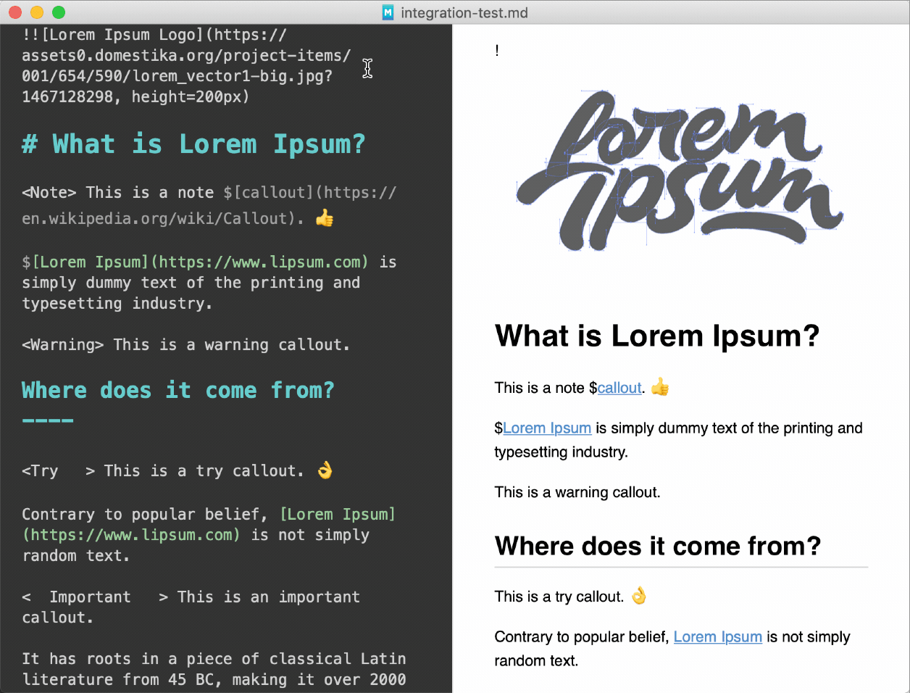

Thesi
=====
 

	
	
	 
	
	 
	 
	<b>A <a href="https://macdown.uranusjr.com">MacDown</a> plugin that offers shorthand syntax for callouts and images.</b>
	 

---

### Looking for...

- A Floating Action Button for macOS? Check out [Fab.](https://github.com/chriszielinski/Fab) 🛍️.
- An Expanding Bubble Text Field for macOS? Check out [BubbleTextField](https://github.com/chriszielinski/BubbleTextField) 💬.
- An integrated spotlight-based onboarding and help library for macOS? Check out [Enlighten](https://github.com/chriszielinski/Enlighten) 💡.

Features
========

* Add callouts to your Markdown with a tag.
* Easily specify dimensions and center alignment of images.
* Supports MacDown undo/redo.
* GitHub-Flavored Markdown friendly.

Callouts
========

Callouts are a short piece of text stylized with the intent of attracting attention. 

The syntax of a 'callout-name' callout is:

	<callout-name> message
	
For example, a syntactic 'note' callout would look like so:

	<Note> This is a note callout.
	
And after invoking Thesi, will render as so:

> 📌 **Note:** This is a note callout.

---

The currently available callouts are:

> 📌 **Note:** This is a note callout.

> ⚠️ **Warning:** This is a warning callout.

> 🎡 **Try:** This is a try callout.

> 📣 **Important:** This is an important callout.

> 🔥 This is a fire callout.

> 🐞 **Bug:** This is a bug callout.

Images
======

> 📣 **Important:** Your flavor of Markdown must support raw HTML.

Thesi also simplifies formatting images by providing syntax for specifying image dimensions and center alignment.

### Dimensions

To set the image height and/or width, just add the appropriate attributes after the image URL.

	
	
Thesi will replace the Markdown image syntax with its equivalent `` element.

### Center Align

Centering an image is as simple as prepending an extra `!`.

	!
	
Thesi will nest the image in a center-aligned `
` element.

### Example

Before Thesi:

	!
	
After Thesi:

	

    	
	

    

